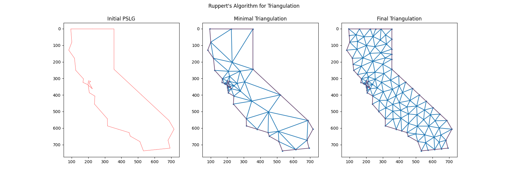
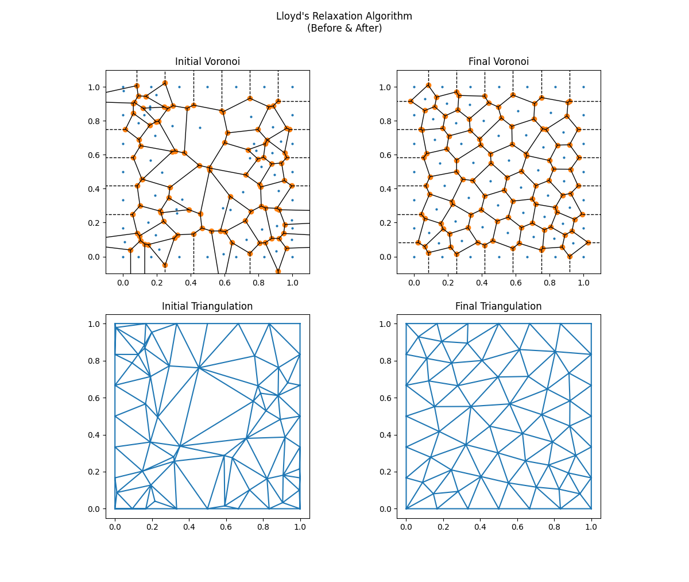

# Mesh Generation and Refinement

This project includes implementations of various mesh generation and refinement algorithms including
- [x] **Computing Delaunay triangulation** using the Bowyer-Watson algorithm (triangulation.py)
- [x] **Quality mesh generation** using Ruppert's algorithm (rupperts.py)
- [x] **Improve mesh uniformity** using Voronoi relaxation or Lloyd's algorithm (lloyds.py)

The motivation for this project is to generate high quality meshes for use in finite element analysis and other applications. 

## Description
- triangulation.py - triangulates a set of points according to Delaunay algorithm
- rupperts.py - given planar straight line graph (PSLG), generates a minimal mesh with high quality triangles
- lloyds.py - improves mesh uniformity by iteratively moving vertices to the centroid of their Voronoi region

## Examples
### Ruppert's algorithm
Given an SVG file of the outline of California, we parse the file into a PSLG (left), compute the minimal triangulation using Ruppert's algorithm (middle), and refine it further until a given maximum triangle size (right).

Near the Bay Area, we see that the triangles are smaller than in the rest of the state. This is because the outline of the bay has smaller features and thus needs smaller and more triangles to capture the shape.

### Lloyd's algorithm
Starting with an initial mesh (left) consisting of a random set of points, we apply Lloyd's algorithm to improve the mesh uniformity (right).

The initial voronoi and delaunay diagrams are very irregular, but after a few iterations of Lloyd's algorithm, the triangle uniformity improves significantly.

